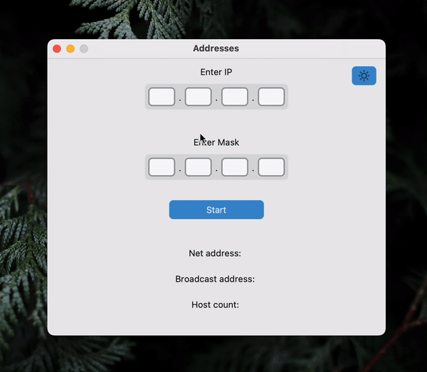

# ipv4-subnet-calculator



## Description 📃
Python program with GUI interface ( using [customtkinter](https://customtkinter.tomschimansky.com) ), which calculates IPv4 subnet address, broadcast address and maximum number of hosts.

## Libraries
| Library name  | Version | Purpose                       |
|---------------|---------|-------------------------------|
| customtkinter | 5.1.3   | to create GUI interface       |
| Pillow        | 9.5.0   | to add icons to GUI interface |

## Future features 🔮
 - [x] Add dark/light theme switcher
 - [ ] Create function which calculates **first** and **last** host address in subnet
 - [ ] Add auto-tab to IPv4 address and mask inputs (ex.)
```
IPv4 form (_ is current cursor position)
_[1].[].[].[]
_[19].[].[].[]
[192]._[].[].[]
``` 